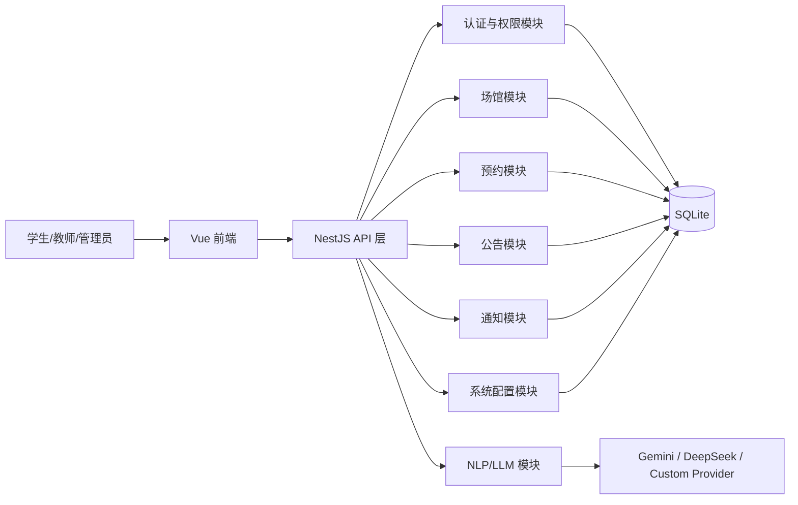
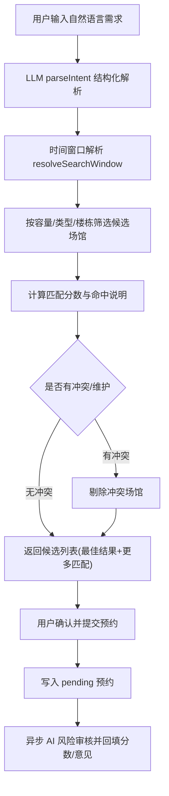
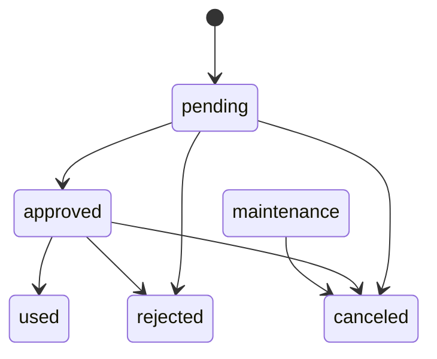
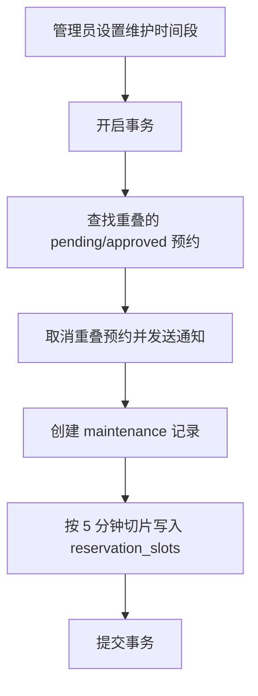
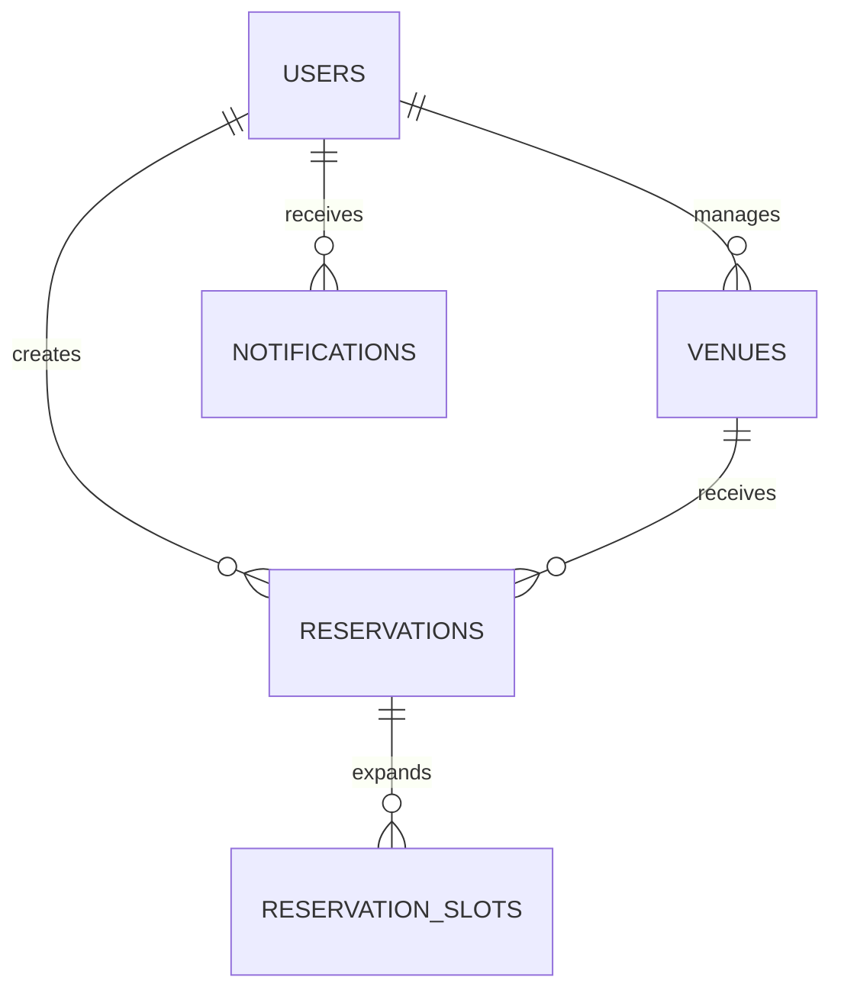

# 校园场馆预约系统项目报告

## 1. 项目概述与设计意图

本项目面向高校“教室/场馆预约”场景，目标是构建一个覆盖检索、预约、审核、公告通知和系统配置的完整业务闭环。系统采用前后端分离架构：

- 前端：Vue 3 + Element Plus + Vite
- 后端：NestJS 11 + TypeORM + SQLite
- 智能能力：LLM 意图解析、搜索解释、活动提案扩写、风险审核

设计意图主要体现在以下四点：

1. 以用户任务为中心：学生/教师从“提需求”到“完成预约”的操作尽量短链路。
2. 以业务可控为边界：管理员可配置审核规则、提示词、维护窗口和权限范围。
3. 以一致性为底线：通过事务、状态机和时段槽位索引保证并发下的预约正确性。
4. 以可用性为原则：LLM 链路失败时自动降级，避免核心检索流程不可用。

## 2. 总体架构与模块划分

### 2.1 后端核心模块

- `auth`：登录、改密、忘记密码、单活会话（sid）。
- `users`：用户信息、角色、管理范围（楼栋/楼层）。
- `venues`：场馆管理、结构视图、可用性看板、智能检索、维护调度。
- `reservations`：单次/批量/周期预约、审批状态流转、冲突控制、AI 风险写回。
- `announcements`：公告发布与定向展示。
- `notifications`：通知投递、未读统计、已读状态。
- `system-config`：LLM 配置与提示词治理、结构化导入。
- `llm` / `nlp`：意图解析、审核评分、检索解释、提案扩写。

### 2.2 前端核心模块

- 登录与会话：`frontend/src/views/Login.vue`、`frontend/src/stores/auth.js`
- 主布局与路由鉴权：`frontend/src/layout/MainLayout.vue`、`frontend/src/router/index.js`
- 学生端：总览/场馆/搜索/我的预约
- 管理端：管理概览、场馆管理、审核管理、用户管理、公告管理、系统设置

## 3. 核心业务流程

### 3.1 智能检索与预约流程

### 3.2 审核与状态流转流程

### 3.3 维护窗口调度流程

## 4. 软件使用说明

### 4.1 启动步骤

1. 启动后端：
   - `cd backend-ts`
   - `npm install`
   - `npm run dev`
2. 启动前端：
   - `cd frontend`
   - `npm install`
   - `npm run dev`
3. 默认管理员：
   - 用户名：`admin`
   - 密码：`admin123`

### 4.2 学生/教师端使用流程

1. 登录系统（首次登录会提示强制修改密码）。
2. 在“搜索”输入自然语言需求（如人数、楼栋、设备、时间）。
3. 查看“最佳结果 + 更多匹配”，选择场馆并填入预约信息。
4. 提交后可在“我的预约”查看状态与 AI 风险提示。
5. 对于未开始的已通过预约，可执行取消操作。

### 4.3 管理员端使用流程

1. 在“管理概览”查看统计与楼栋空闲看板。
2. 在“审核管理”对预约进行通过/驳回/标记已使用。
3. 在“场馆管理”维护场馆信息并设置维护时段。
4. 在“用户管理”维护角色与管理范围。
5. 在“系统设置”配置 LLM 参数、提示词与结构化导入。

## 5. 数据结构设计

### 5.1 核心实体关系

### 5.2 关键表与字段说明

1. `users`
   - 核心字段：`role`、`managed_building`、`managed_floor`、`login_session_id`
   - 作用：RBAC + 数据权限范围 + 单活会话控制
2. `venues`
   - 核心字段：`building_name`、`floor_label`、`room_code`、`status`、`facilities`
   - 作用：结构化空间定位 + 检索匹配 + 可用状态标记
3. `reservations`
   - 核心字段：`start_time`、`end_time`、`status`、`ai_risk_score`、`ai_audit_comment`
   - 作用：预约主记录 + 审批状态 + 风险结果
4. `reservation_slots`
   - 核心字段：`venue_id`、`slot_start`（唯一索引）
   - 作用：并发冲突检测的“离散时间索引”

## 6. 数据结构与算法实现（技术重点）

### 6.1 时段冲突控制算法（重点难点）

实现位置：

- `backend-ts/src/reservations/utils/slot-utils.ts`
- `backend-ts/src/reservations/entities/reservation-slot.entity.ts`
- `backend-ts/src/reservations/reservations.service.ts`

核心思想：

1. 将预约时间段按 `5` 分钟离散化。
2. 将每个切片写入 `reservation_slots`。
3. 依赖 `(venue_id, slot_start)` 唯一索引阻断并发冲突。

关键细节：

- `buildSlotWindows` 使用 `floor(start)` 与 `ceil(end)` 对齐切片边界，避免边界遗漏。
- 审核通过或维护状态写槽位；取消/驳回等非阻塞状态删除槽位。
- 即使应用层并发校验同时通过，数据库唯一约束仍可做最终防线。

观点：

相比“仅用时间区间重叠 SQL 判断”，槽位索引在高并发审批和维护批处理下更稳定，可把冲突从“逻辑判断问题”降级成“索引冲突问题”。

### 6.2 预约状态机算法

实现位置：`backend-ts/src/reservations/reservations.service.ts`

状态转移通过 `ALLOWED_STATUS_TRANSITIONS` 显式定义，非法转移直接拒绝。该做法优势：

1. 规则集中，易审计和扩展。
2. 与角色权限校验分离，职责清晰。
3. 能直接覆盖到测试用例矩阵。

### 6.3 周期预约生成算法

实现位置：`buildRecurringDrafts(...)`

算法说明：

1. 支持 `daily` 与 `weekly` 两类频率。
2. 支持 `interval`、`occurrences`、`until` 组合控制。
3. 每次生成保持原始时长不变（`durationMs`）。
4. 通过 `guard < 5000` 防止异常规则导致死循环。

复杂度：

- 日频：约 `O(n)`（n 为 occurrences）
- 周频：约 `O(d)`（d 为遍历天数）

### 6.4 智能检索评分算法

实现位置：`backend-ts/src/venues/venues.service.ts::search`

评分策略（启发式）：

1. 基础分 `10`
2. 容量满足 +10，否则 -10
3. 每个设备命中 +20
4. 每个关键词命中 +15
5. 类型关键词命中 +5
6. 楼栋命中 +10
7. 与已批准/维护时段冲突的场馆直接剔除

观点：

该策略具备可解释性强、可快速迭代的优点；缺点是对语义近义词和隐含偏好建模较弱，后续可引入学习排序（Learning to Rank）做二阶段重排。

### 6.5 异步 AI 风险审核队列

实现位置：`backend-ts/src/reservations/reservations.service.ts`

机制：

1. 预约创建后先快速返回 `pending`。
2. 将预约 ID 放入内存队列。
3. `MAX_AUDIT_CONCURRENCY = 2` 控制并发审查量。
4. 完成后回写 `ai_risk_score` 与 `ai_audit_comment`。

价值：

- 把高延迟的 LLM 调用从主交易链路剥离，显著改善提交响应时间。

### 6.6 LLM 多提供商与降级策略

实现位置：`backend-ts/src/llm/llm.service.ts`

关键设计：

1. 支持 `gemini / deepseek / custom` 三类 provider。
2. 配置缓存 TTL 60 秒，减少数据库读取频次。
3. 模型调用超时控制 12 秒。
4. JSON 提取统一入口，保障结构化输出。
5. 失败后进入规则/关键词 fallback，保证核心检索可用。

## 7. 设计模式选取与说明

1. 依赖注入（DI）
   - NestJS `@Injectable` + 构造器注入，降低模块耦合，便于测试替换。
2. 仓储模式（Repository Pattern）
   - TypeORM Repository 统一数据访问，隔离业务层与 SQL 细节。
3. 装饰器 + 守卫（Decorator + Guard）
   - `@Roles` + `RolesGuard` + `JwtAuthGuard` 形成横切鉴权机制。
4. 策略模式（Strategy）
   - LLM provider 选择逻辑抽象在 `callLlm`，按 provider 切换调用策略。
5. 事务脚本（Transaction Script）
   - 预约审批与维护调度使用 `QueryRunner` 在同事务内保证一致性。
6. 失败降级模式（Fail-safe Fallback）
   - 智能检索解释、意图解析失败后均可退回基础逻辑。

## 8. 技术难点与个人观点

1. 难点一：并发冲突与审批时序
   - 观点：应优先采用数据库可证明约束（唯一索引）而不是只依赖应用层锁。
2. 难点二：时间与时区歧义
   - 观点：后端强制输入带时区偏移（`Z` 或 `±HH:mm`）非常必要，能避免跨端解释偏差。
3. 难点三：LLM 可用性与确定性
   - 观点：在业务系统里，LLM 应是“增强层”，而非“单点依赖”；本项目降级设计方向正确。
4. 难点四：权限与数据范围
   - 观点：角色权限与楼栋/楼层数据权限分层设计，可兼顾灵活性与安全性。

可进一步优化建议：

1. 将 AI 审核队列外置到消息队列（如 Redis Stream）提升服务重启后的任务可靠性。
2. 为预约创建引入幂等键，减少客户端重复提交导致的脏数据。
3. 对检索评分增加权重配置化能力，让管理员可按校内实际需求调整策略。

## 9. 模块界面截图与全流程演示（文档末尾附件）

请在提交前将截图放入 `report-assets/screenshots/`，并在下方替换为真实图片文件。建议按编号命名，便于评阅老师快速核对。

### 9.1 各模块截图清单

1. 登录页：`01-login.png`
2. 学生端总览页：`02-student-overview.png`
3. 智能搜索页（含“最佳结果+更多匹配”）：`03-student-search.png`
4. 预约填写弹窗（单次/批量/周期任一或多张）：`04-reservation-form.png`
5. 我的预约页：`05-my-reservations.png`
6. 管理端概览页：`06-admin-dashboard.png`
7. 管理端审核页（含 AI 风险标签）：`07-admin-audit.png`
8. 管理端场馆管理页（含维护操作）：`08-admin-venues.png`
9. 管理端用户管理页：`09-admin-users.png`
10. 系统设置页（LLM 配置/导入）：`10-system-settings.png`

### 9.2 模拟运行全流程截图或演示视频

建议完整流程：

1. 学生端登录并发起智能搜索
2. 提交预约并进入待审核
3. 管理员审核通过/驳回
4. 学生端查看状态变化与通知
5. 管理员设置维护时段并触发冲突取消通知（可选）

附件建议二选一：

1. 全流程关键节点截图（至少 6 张）
2. 一段 2~5 分钟演示视频（推荐 `mp4`）

视频文件示例路径：

- `report-assets/video/full-process-demo.mp4`

