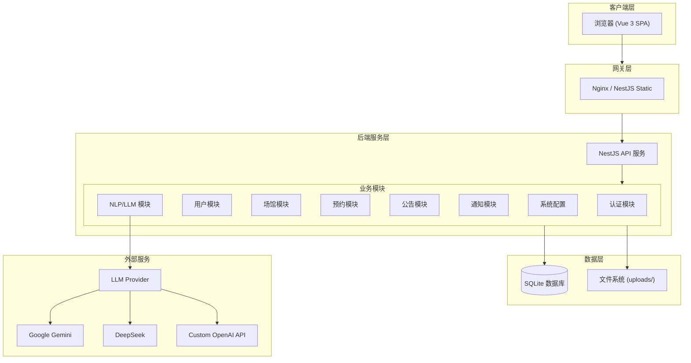
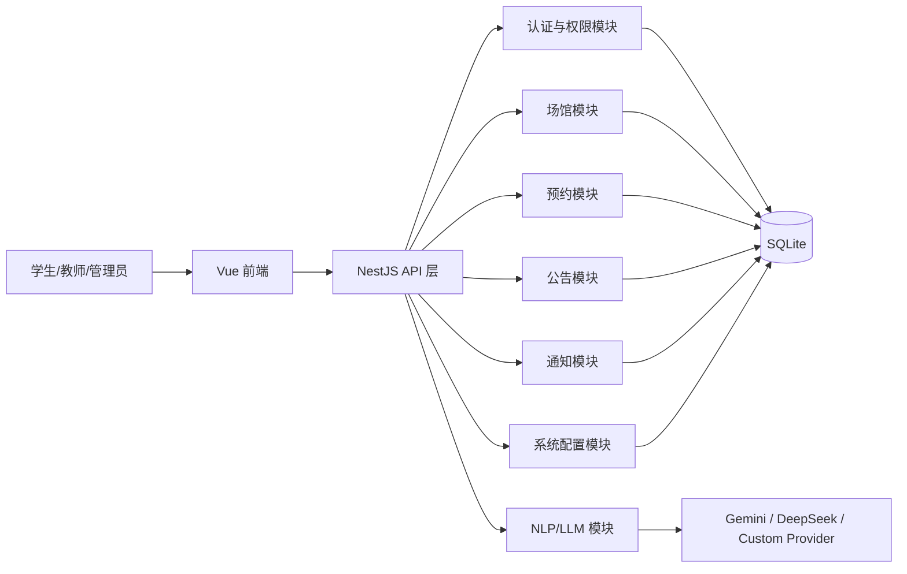
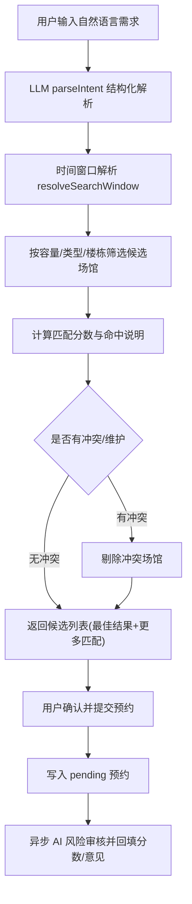
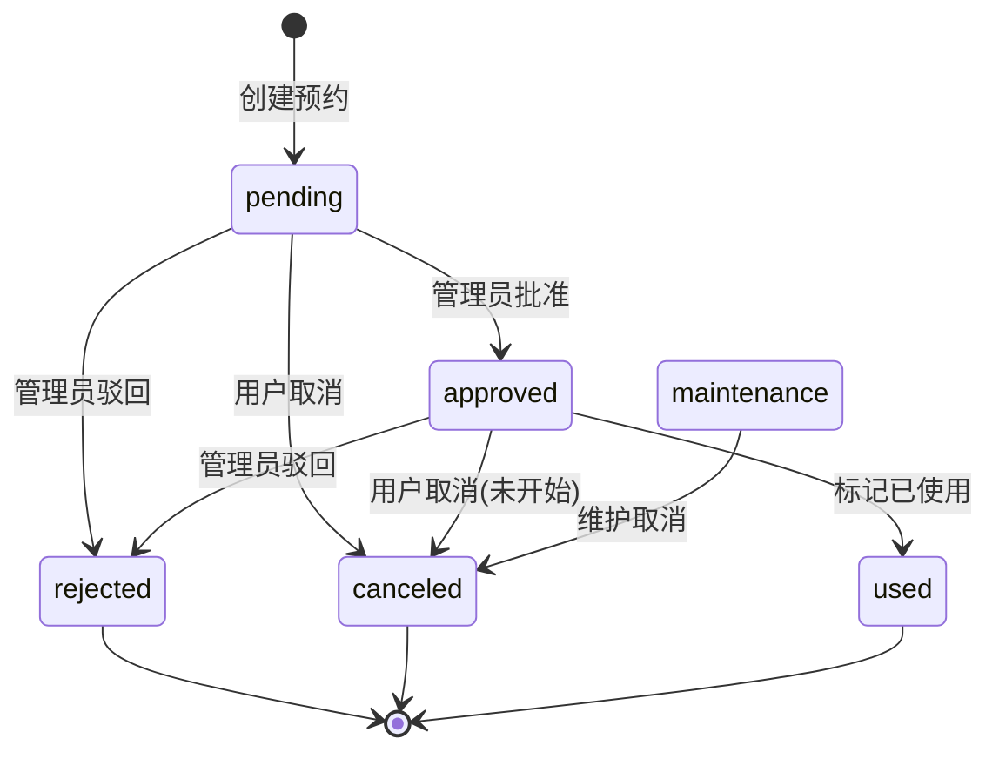
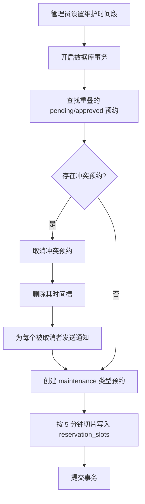
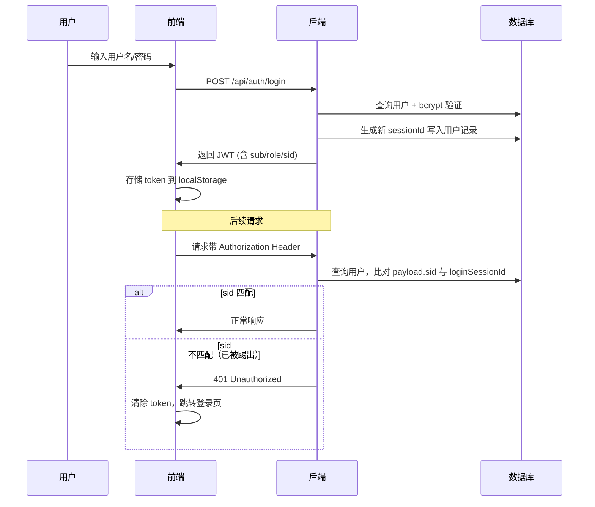
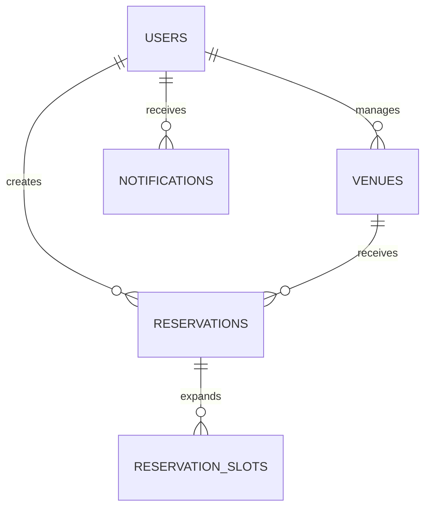

# 校园场馆预约系统项目报告

## 1. 项目概述与设计意图

### 1.1 项目背景

本项目面向高校"教室/场馆预约"场景，目标是构建一个覆盖检索、预约、审核、公告通知和系统配置的完整业务闭环。系统采用前后端分离架构，并深度集成大语言模型（LLM）能力，实现智能化的场馆检索与风险评估。

### 1.2 技术栈总览

| 层面 | 技术选型 | 版本 |
| ------ | ---------- | ------ |
| 前端框架 | Vue 3 (Composition API / `<script setup>`) | 3.3.0 |
| 前端构建 | Vite | 4.5.0 |
| UI 组件库 | Element Plus | 2.4.0 |
| 状态管理 | Pinia | 2.1.0 |
| 前端路由 | Vue Router | 4.2.0 |
| HTTP 客户端 | Axios | 1.6.0 |
| 后端框架 | NestJS | 11.x |
| ORM | TypeORM | 0.3.x |
| 数据库 | SQLite | 5.x |
| 认证 | Passport-JWT + bcryptjs | — |
| AI/LLM | Google Gemini / DeepSeek / 自定义 OpenAI 兼容 API | — |
| 容器化 | Docker 多阶段构建 (Node 20 Alpine) | — |

### 1.3 设计意图

设计意图主要体现在以下四点：

1. **以用户任务为中心**：学生/教师从"提需求"到"完成预约"的操作尽量短链路，通过自然语言智能检索一步到位。
2. **以业务可控为边界**：管理员可配置审核规则、提示词、维护窗口和权限范围，实现灵活的业务治理。
3. **以一致性为底线**：通过事务、状态机和时段槽位索引保证并发下的预约正确性，杜绝双重预订。
4. **以可用性为原则**：LLM 链路失败时自动降级到规则/关键词匹配，避免核心检索流程不可用。

### 1.4 核心特色功能

- **AI 驱动的智能检索**：自然语言输入 → 意图解析 → 多维评分 → 自动填表
- **双层冲突检测**：应用层重叠查询 + 数据库唯一索引（5 分钟粒度时间槽）
- **异步 AI 风险评估**：预约提交后异步评估，不阻塞主流程
- **四级角色体系**：系统管理员 / 场馆管理员 / 楼层管理员 / 师生用户
- **单点登录控制**：JWT 内嵌 sessionId，改密/重登自动踢出旧会话
- **VisionOS 风格 UI**：毛玻璃态设计 + 浮动岛屿布局

## 2. 总体架构与模块划分

### 2.0 系统架构图





### 2.1 后端核心模块

| 模块 | 位置 | 职责说明 |
| ------ | ------ | ---------- |
| `auth` | `src/auth/` | 登录认证、JWT 签发、改密、忘记密码、单活会话（sid）控制 |
| `users` | `src/users/` | 用户 CRUD、角色管理、管理范围（楼栋/楼层）分配 |
| `venues` | `src/venues/` | 场馆 CRUD、结构视图、可用性看板、智能检索、维护调度 |
| `reservations` | `src/reservations/` | 单次/批量/周期预约、审批状态流转、冲突控制、AI 风险写回 |
| `announcements` | `src/announcements/` | 公告发布、按角色/楼栋定向展示 |
| `notifications` | `src/notifications/` | 通知投递、未读统计、已读状态管理 |
| `system-config` | `src/system-config/` | LLM 配置、提示词治理、CSV 结构化导入 |
| `llm` | `src/llm/` | 多 Provider 调用、意图解析、审核评分、检索解释、提案扩写 |
| `nlp` | `src/nlp/` | NLP 控制器，对外暴露 AI 能力端点 |

### 2.2 前端核心模块

| 模块 | 位置 | 职责说明 |
| ------ | ------ | ---------- |
| 登录认证 | `views/Login.vue` | 登录表单、忘记密码、首次登录检测 |
| 状态管理 | `stores/auth.js` | Pinia Store，管理 token/user/持久化 |
| 主布局 | `layout/MainLayout.vue` | VisionOS 风格侧边栏、浮动头部、通知面板、强制改密弹窗 |
| 路由鉴权 | `router/index.js` | 角色守卫、作用域检查、会话验证（5 分钟 TTL 缓存） |
| API 层 | `api/services.js` | 全部后端 API 封装，含请求/响应拦截器 |
| 学生总览 | `views/student/Dashboard.vue` | 公告、楼栋看板、场馆浏览、智能搜索、预约表单 |
| 我的预约 | `views/student/Reservations.vue` | 预约列表、状态展示、取消操作 |
| 管理概览 | `views/admin/Dashboard.vue` | 统计药丸、资源分布、近期活动时间线 |
| 场馆管理 | `views/admin/VenueManagement.vue` | 场馆 CRUD、照片上传、维护计划 |
| 审核管理 | `views/admin/AdminAudit.vue` | 预约审批、AI 风险展示、拒绝原因填写 |
| 用户管理 | `views/admin/UserManagement.vue` | 用户 CRUD、角色分组、密码重置 |
| 系统设置 | `views/admin/SystemSettings.vue` | LLM 配置、提示词编辑、CSV 导入 |

## 3. 核心业务流程

### 3.1 智能检索与预约流程



**智能检索链路详解**：

1. **意图解析**：调用 `llmService.parseIntent()` 将自然语言转为结构化 JSON：

   ```json
   {
     "date": "2026-03-01",
     "time_start": "14:00",
     "time_end": "16:00",
     "capacity": 50,
     "facilities": ["投影仪", "音响"],
     "building": "明德楼",
     "venue_type": "会议室"
   }
   ```

2. **时间窗口解析**：`resolveSearchWindow()` 处理相对时间表达（"明天下午"、"下周一"），转为绝对时间范围

3. **多维评分**：基于容量匹配、设施命中、楼栋偏好等维度计算综合得分

4. **冲突检测**：查询 `reservation_slots` 排除已被占用的场馆

5. **结果解释**：调用 `llmService.explainVenueSearch()` 生成中文摘要与优化建议

### 3.2 审核与状态流转流程



**状态转移规则**（`ALLOWED_STATUS_TRANSITIONS`）：

| 当前状态 | 允许转移到 |
| ---------- | ------------ |
| `pending` | `approved`, `rejected`, `canceled` |
| `approved` | `used`, `canceled`, `rejected` |
| `maintenance` | `canceled` |
| `rejected` | （终态） |
| `canceled` | （终态） |
| `used` | （终态） |

### 3.3 维护窗口调度流程



### 3.4 认证与会话管理流程



## 4. 软件使用说明

### 4.1 环境要求

- Node.js 18+（推荐 20.x）
- npm 8+ 或 yarn
- （可选）Docker & Docker Compose

### 4.2 本地开发启动

#### 方式一：分别启动前后端

```bash
# 1. 启动后端
cd backend-ts
npm install
npm run dev    # 监听 http://localhost:8001

# 2. 启动前端（新终端）
cd frontend
npm install
npm run dev    # 监听 http://localhost:5173，代理 /api → 8001
```

#### 方式二：Docker 一键部署

```bash
docker-compose up -d --build
# 访问 http://localhost:80
```

### 4.3 默认账户

| 角色         | 用户名  | 默认密码     |
| ------------ | ------- | ------------ |
| 系统管理员   | `admin` | `admin123`   |

> **首次登录强制改密**：所有用户首次登录后必须修改密码。

### 4.4 学生/教师端使用流程

1. **登录系统**：输入用户名密码，首次登录会弹出强制改密对话框
2. **智能搜索**：进入"搜索"页面，输入自然语言需求（如"帮我找个明天下午容纳50人的会议室"）
3. **预约场馆**：查看"最佳结果"与"更多匹配"，点击"预约"按钮填写信息
4. **查看状态**：在"我的预约"查看状态与 AI 风险提示
5. **取消预约**：对未开始的已通过预约可执行取消操作

### 4.5 管理员端使用流程

1. **管理概览**：查看统计数据与楼栋教室空闲看板
2. **审核管理**：对预约进行通过/驳回/标记已使用，查看 AI 风险评分
3. **场馆管理**：维护场馆信息、上传照片、设置维护时段
4. **用户管理**：维护角色与管理范围（仅系统管理员）
5. **系统设置**：配置 LLM、编辑提示词、CSV 导入（仅系统管理员）

### 4.6 API 端点速查

| 模块 | 端点前缀 | 主要操作 |
| ------ | ---------- | ---------- |
| 认证 | `/api/auth` | login, change-password, forgot-password |
| 用户 | `/api/users` | CRUD, me, reset-password |
| 场馆 | `/api/venues` | CRUD, search, search-smart, maintenance |
| 预约 | `/api/reservations` | CRUD, batch, recurring |
| NLP | `/api/nlp` | parse, expand-proposal |
| 配置 | `/api/system-config` | get, update, import |

## 5. 数据结构设计

### 5.1 核心实体关系



### 5.2 枚举定义

```typescript
// 用户角色（四级权限体系）
enum UserRole {
    STUDENT_TEACHER = 'student_teacher',
    FLOOR_ADMIN = 'floor_admin',
    VENUE_ADMIN = 'venue_admin',
    SYS_ADMIN = 'sys_admin',
}

// 预约状态
enum ReservationStatus {
    PENDING = 'pending',
    APPROVED = 'approved',
    REJECTED = 'rejected',
    CANCELED = 'canceled',
    USED = 'used',
    MAINTENANCE = 'maintenance',
}
```

### 5.3 关键表与字段说明

1. `users`
   - 核心字段：`role`、`managed_building`、`managed_floor`、`login_session_id`
   - 作用：RBAC + 数据权限范围 + 单活会话控制
2. `venues`
   - 核心字段：`building_name`、`floor_label`、`room_code`、`status`、`facilities`
   - 作用：结构化空间定位 + 检索匹配 + 可用状态标记
3. `reservations`
   - 核心字段：`start_time`、`end_time`、`status`、`ai_risk_score`、`ai_audit_comment`
   - 作用：预约主记录 + 审批状态 + 风险结果
4. `reservation_slots`
   - 核心字段：`venue_id`、`slot_start`（唯一索引）
   - 作用：并发冲突检测的“离散时间索引”

## 6. 数据结构与算法实现（技术重点）

### 6.1 时段冲突控制算法（重点难点）

**实现位置**：`backend-ts/src/reservations/utils/slot-utils.ts`

**核心代码**：

```typescript
export const SLOT_MINUTES = 5;

export function buildSlotWindows(start: Date, end: Date) {
    const slotMs = SLOT_MINUTES * 60 * 1000;
    const fromMs = Math.floor(start.getTime() / slotMs) * slotMs;
    const toMs = Math.ceil(end.getTime() / slotMs) * slotMs;
    const windows = [];
    for (let ms = fromMs; ms < toMs; ms += slotMs) {
        windows.push({ start: new Date(ms), end: new Date(ms + slotMs) });
    }
    return windows;
}
```

**核心思想**：

1. 将预约时间段按 `5` 分钟离散化。
2. 将每个切片写入 `reservation_slots`。
3. 依赖 `(venue_id, slot_start)` 唯一索引阻断并发冲突。

关键细节：

- `buildSlotWindows` 使用 `floor(start)` 与 `ceil(end)` 对齐切片边界，避免边界遗漏。
- 审核通过或维护状态写槽位；取消/驳回等非阻塞状态删除槽位。
- 即使应用层并发校验同时通过，数据库唯一约束仍可做最终防线。

观点：

相比“仅用时间区间重叠 SQL 判断”，槽位索引在高并发审批和维护批处理下更稳定，可把冲突从“逻辑判断问题”降级成“索引冲突问题”。

### 6.2 预约状态机算法

**实现位置**：`backend-ts/src/reservations/reservations.service.ts`

**核心代码**：

```typescript
private static ALLOWED_STATUS_TRANSITIONS: Record<string, ReservationStatus[]> = {
    [ReservationStatus.PENDING]: [
        ReservationStatus.APPROVED, 
        ReservationStatus.REJECTED, 
        ReservationStatus.CANCELED
    ],
    [ReservationStatus.APPROVED]: [
        ReservationStatus.CANCELED, 
        ReservationStatus.USED, 
        ReservationStatus.REJECTED
    ],
    // 终态：不允许进一步转换
    [ReservationStatus.REJECTED]: [],
    [ReservationStatus.CANCELED]: [],
    [ReservationStatus.USED]: [],
    [ReservationStatus.MAINTENANCE]: [ReservationStatus.CANCELED],
};

private assertStatusTransitionValid(
    currentStatus: ReservationStatus, 
    targetStatus: ReservationStatus
) {
    const allowed = ReservationsService.ALLOWED_STATUS_TRANSITIONS[currentStatus];
    if (!allowed || !allowed.includes(targetStatus)) {
        throw new BadRequestException(
            `Cannot transition from '${currentStatus}' to '${targetStatus}'`
        );
    }
}
```

**设计优势**：

1. 规则集中化，易审计和扩展（新增状态只需修改一处）
2. 与角色权限校验分离，职责清晰
3. 能直接映射到测试用例矩阵，便于全覆盖测试
4. 终态设置为空数组，天然防止非法回退

### 6.3 周期预约生成算法

**实现位置**：`backend-ts/src/reservations/reservations.service.ts::buildRecurringDrafts`

**核心代码（周频模式）**：

```typescript
const weekdays = recurrence.week_days?.length > 0
    ? Array.from(new Set(recurrence.week_days)).sort((a, b) => a - b)
    : [baseStart.getUTCDay()];

let guard = 0;
while (rows.length < desiredOccurrences && cursor <= maxUntil && guard < 5000) {
    guard += 1;
    const dayDateUtc = Date.UTC(cursor.getUTCFullYear(), cursor.getUTCMonth(), cursor.getUTCDate());
    const dayDiff = Math.floor((dayDateUtc - baseDateUtc) / (24 * 60 * 60 * 1000));
    
    const weekIndex = Math.floor(dayDiff / 7);
    const dayOfWeek = cursor.getUTCDay();
    const matchWeek = weekIndex % interval === 0;  // 间隔周匹配
    const matchDay = weekdays.includes(dayOfWeek); // 星期几匹配

    if (matchWeek && matchDay) {
        const start = new Date(Date.UTC(
            cursor.getUTCFullYear(), cursor.getUTCMonth(), cursor.getUTCDate(),
            baseStart.getUTCHours(), baseStart.getUTCMinutes()
        ));
        rows.push(this.withDraftTime(source, start, new Date(start.getTime() + durationMs)));
    }
    cursor.setUTCDate(cursor.getUTCDate() + 1);
}
```

**算法说明**：

| 参数          | 作用                                      |
|---------------|------------------------------------------ |
| `frequency`   | 支持 `daily`（日频）与 `weekly`（周频）两类 |
| `interval`    | 间隔数（如间隔 2 表示隔周/隔日） |
| `occurrences` | 生成次数上限（最大 100 次） |
| `until`       | 截止日期（与 occurrences 二选一）       |
| `week_days`   | 周频模式下的星期选择（0=周日, 1=周一...）|

**安全防护**：

- `guard < 5000` 防止异常规则导致死循环
- `MAX_RECURRING_OCCURRENCES = 100` 限制最大生成数量
- 所有时间使用 UTC 计算，避免夏令时和时区问题

### 6.4 智能检索评分算法

实现位置：`backend-ts/src/venues/venues.service.ts::search`

评分策略（启发式）：

1. 基础分 `10`
2. 容量满足 +10，否则 -10
3. 每个设备命中 +20
4. 每个关键词命中 +15
5. 类型关键词命中 +5
6. 楼栋命中 +10
7. 与已批准/维护时段冲突的场馆直接剔除

观点：

该策略具备可解释性强、可快速迭代的优点；缺点是对语义近义词和隐含偏好建模较弱，后续可引入学习排序（Learning to Rank）做二阶段重排。

### 6.5 异步 AI 风险审核队列

**实现位置**：`backend-ts/src/reservations/reservations.service.ts`

**核心代码**：

```typescript
private readonly MAX_AUDIT_CONCURRENCY = 2;
private auditQueue: number[] = [];
private pendingAuditIds = new Set<number>();
private runningAuditTasks = 0;

private drainAuditQueue() {
    while (this.runningAuditTasks < this.MAX_AUDIT_CONCURRENCY && this.auditQueue.length > 0) {
        const reservationId = this.auditQueue.shift();
        if (!reservationId) continue;
        
        this.runningAuditTasks += 1;
        this.runAuditTask(reservationId)
            .catch((error) => {
                console.error(`Failed to audit reservation ${reservationId}:`, error);
            })
            .finally(() => {
                this.runningAuditTasks = Math.max(0, this.runningAuditTasks - 1);
                this.pendingAuditIds.delete(reservationId);
                this.drainAuditQueue(); // 递归消费队列
            });
    }
}
```

**机制说明**：

| 组件 | 作用 |
| ------ | ------ |
| `auditQueue` | 待审核预约 ID 队列 |
| `pendingAuditIds` | 避免同一预约重复入队 |
| `MAX_AUDIT_CONCURRENCY = 2` | 控制并发审查量 |
| `drainAuditQueue` | 递归消费直到队列为空或达并发上限 |

**价值**：

- 把高延迟的 LLM 调用从主交易链路剥离
- 预约创建后快速返回 `pending`，审核结果异步回写
- 显著改善用户提交预约时的响应体验

### 6.6 LLM 多提供商与降级策略

**实现位置**：`backend-ts/src/llm/llm.service.ts`

**核心代码（策略分发）**：

```typescript
private async callLlm(prompt: string): Promise<string> {
    // Gemini 调用路径
    if (this.provider === 'gemini' && this.client) {
        const model = this.client.getGenerativeModel({ model: this.modelId });
        const mergedPrompt = [this.systemPrompt, this.jsonGuardPrompt, prompt]
            .filter(Boolean).join('\n\n');
        const result = await this.withTimeout(
            model.generateContent(mergedPrompt),
            this.LLM_CALL_TIMEOUT_MS, 'Gemini timeout'
        );
        return (await result.response).text();
    }

    // DeepSeek / Custom OpenAI 兼容调用路径
    if ((this.provider === 'deepseek' || this.provider === 'custom') && this.openaiClient) {
        const messages = [
            { role: 'system', content: this.systemPrompt },
            { role: 'system', content: this.jsonGuardPrompt },
            { role: 'user', content: prompt }
        ].filter(m => m.content);
        
        const response = await fetch(`${this.openaiClient.baseUrl}/v1/chat/completions`, {
            method: 'POST',
            headers: {
                'Content-Type': 'application/json',
                'Authorization': `Bearer ${this.openaiClient.apiKey}`,
            },
            body: JSON.stringify({ model: this.modelId, messages, temperature: 0.1 }),
        });
        // ...
    }
}
```

**关键设计**：

| 特性 | 实现方式 |
| ------ | ---------- |
| 多 Provider 支持 | `gemini` / `deepseek` / `custom` 三类，按 provider 字段切换 |
| 配置缓存 | TTL 60 秒，减少数据库读取频次 |
| 超时控制 | `withTimeout()` 包装，12 秒超时抛出异常 |
| JSON 提取 | `extractJson<T>()` 统一入口，支持 markdown 代码块清洗 |
| 失败降级 | 调用失败后进入规则/关键词 fallback，保证检索基本可用 |

**观点**：

LLM 在业务系统中应作为"增强层"而非"单点依赖"，本项目的降级设计使得即使 AI 服务不可用，核心预约和检索功能仍可正常工作。

## 7. 设计模式选取与说明

### 7.1 依赖注入（Dependency Injection）

**实现示例**：

```typescript
@Injectable()
export class ReservationsService {
    constructor(
        @InjectRepository(Reservation)
        private readonly reservationRepo: Repository<Reservation>,
        private readonly venuesService: VenuesService,
        private readonly llmService: LlmService,
        private readonly notificationsService: NotificationsService,
    ) {}
}
```

**优势**：NestJS IoC 容器自动管理依赖生命周期，便于单元测试时 Mock 替换。

### 7.2 仓储模式（Repository Pattern）

**实现示例**：

```typescript
// 业务层通过 Repository 抽象访问数据
const reservation = await this.reservationRepo.findOne({
    where: { id },
    relations: ['venue', 'user', 'slots'],
});

// 自定义查询构建器
const qb = this.reservationRepo.createQueryBuilder('r')
    .leftJoinAndSelect('r.venue', 'v')
    .where('r.status = :status', { status: ReservationStatus.PENDING });
```

**优势**：隔离业务层与 SQL 细节，切换数据库时只需修改仓储实现。

### 7.3 装饰器 + 守卫（Decorator + Guard）

**实现示例**：

```typescript
// 自定义角色装饰器
export const Roles = (...roles: UserRole[]) => SetMetadata('roles', roles);

// 角色守卫
@Injectable()
export class RolesGuard implements CanActivate {
    canActivate(context: ExecutionContext): boolean {
        const requiredRoles = this.reflector.get<UserRole[]>('roles', context.getHandler());
        const { user } = context.switchToHttp().getRequest();
        return requiredRoles.some(role => user.role === role);
    }
}

// 控制器使用
@Roles(UserRole.VENUE_ADMIN, UserRole.SYS_ADMIN)
@UseGuards(JwtAuthGuard, RolesGuard)
@Patch(':id/approve')
async approve(@Param('id') id: number) { ... }
```

**优势**：横切关注点（鉴权）与业务逻辑分离，代码复用性高。

### 7.4 策略模式（Strategy Pattern）

**实现示例**：

```typescript
// LLM 提供商策略切换
private async callLlm(prompt: string): Promise<string> {
    if (this.provider === 'gemini') {
        return this.callGemini(prompt);
    }
    if (this.provider === 'deepseek' || this.provider === 'custom') {
        return this.callOpenAICompatible(prompt);
    }
    throw new Error('No valid provider');
}
```

**优势**：新增 LLM 提供商只需扩展策略分支，不影响现有逻辑。

### 7.5 事务脚本（Transaction Script）

**实现示例**：

```typescript
const qr = this.dataSource.createQueryRunner();
await qr.connect();
await qr.startTransaction();
try {
    // 1. 更新预约状态
    await qr.manager.update(Reservation, id, { status: ReservationStatus.APPROVED });
    // 2. 写入时段索引
    await qr.manager.insert(ReservationSlot, slots);
    // 3. 发送通知
    await this.notificationsService.create(...);
    await qr.commitTransaction();
} catch (err) {
    await qr.rollbackTransaction();
    throw err;
} finally {
    await qr.release();
}
```

**优势**：预约审批与槽位写入在同一事务内，保证数据一致性。

### 7.6 失败降级模式（Fail-safe Fallback）

**实现示例**：

```typescript
// 智能检索意图解析
async search(query: string) {
    let intent: IntentResult = {};
    try {
        intent = await this.llmService.parseIntent(query);
    } catch (err) {
        console.warn('LLM parseIntent failed, using keyword fallback');
        intent = this.extractKeywords(query); // 降级到关键词提取
    }
    return this.executeSearch(intent);
}
```

**优势**：LLM 不可用时系统仍可提供基础检索能力，用户体验不中断。

## 8. 技术难点与个人观点

### 8.1 并发冲突与审批时序

**问题描述**：多个管理员同时审批不同预约，可能导致同一时段被重复占用。

**解决方案**：

```typescript
// 依赖数据库唯一索引做最终防线
@Index(['venue', 'slotStart'], { unique: true })
export class ReservationSlot {
    @ManyToOne(() => Venue) venue: Venue;
    @Column() slotStart: Date;
}

// 审批时先尝试写入槽位，冲突则拒绝
try {
    await qr.manager.insert(ReservationSlot, slots);
} catch (err) {
    if (err.code === 'SQLITE_CONSTRAINT') {
        throw new ConflictException('时段已被其他预约占用');
    }
    throw err;
}
```

**观点**：数据库约束比应用层锁更可靠，即使并发校验都通过，唯一索引仍可阻断冲突。

### 8.2 时间与时区歧义

**问题描述**：前后端时区不一致导致预约时间偏移。

**解决方案**：

```typescript
// 强制解析带时区的 ISO8601 字符串
export function parseDateTimeWithTimezone(value: string, fieldName: string): Date {
    const parsed = new Date(value);
    if (Number.isNaN(parsed.getTime())) {
        throw new BadRequestException(`${fieldName} must be valid ISO8601 with timezone`);
    }
    // 验证输入是否包含时区标识
    if (!/[+-]\d{2}:\d{2}|Z$/.test(value)) {
        throw new BadRequestException(`${fieldName} must include timezone offset`);
    }
    return parsed;
}
```

**观点**：后端强制要求 `±HH:mm` 或 `Z` 时区后缀，从根源消除跨端解释偏差。

### 8.3 LLM 可用性与确定性

**问题描述**：LLM 服务不稳定，响应格式不确定。

**解决方案**：

```typescript
// 1. 超时控制
const result = await this.withTimeout(model.generateContent(prompt), 12000, 'Timeout');

// 2. JSON 提取与兜底
private extractJson<T>(rawText: string): T {
    const cleaned = rawText.replace(/```json/g, '').replace(/```/g, '');
    const jsonMatch = cleaned.match(/\{.*\}/s);
    if (jsonMatch) return JSON.parse(jsonMatch[0]);
    throw new Error('Invalid JSON response');
}

// 3. 失败降级
try {
    return await this.llmService.parseIntent(query);
} catch {
    return this.keywordFallback(query);
}
```

**观点**：LLM 应是"增强层"而非"单点依赖"，三重防护（超时+解析+降级）保证系统韧性。

### 8.4 权限与数据范围

**问题描述**：楼层管理员只能管理自己负责的楼层，但角色权限是全局的。

**解决方案**：

```typescript
// 角色权限（全局）
@Roles(UserRole.FLOOR_ADMIN, UserRole.VENUE_ADMIN, UserRole.SYS_ADMIN)

// 数据权限（范围过滤）
private applyBuildingFilter(qb: SelectQueryBuilder, user: User) {
    if (user.role === UserRole.FLOOR_ADMIN) {
        qb.andWhere('v.building_name = :building', { building: user.managedBuilding })
          .andWhere('v.floor_label = :floor', { floor: user.managedFloor });
    } else if (user.role === UserRole.VENUE_ADMIN) {
        qb.andWhere('v.building_name = :building', { building: user.managedBuilding });
    }
    // SYS_ADMIN 无限制
}
```

**观点**：角色权限与数据范围分层设计，既保证安全又保持灵活，新增管理维度时易于扩展。

### 8.5 可进一步优化方向

| 优化项 | 建议方案 | 预期收益 |
| -------- | ---------- | ---------- |
| AI 审核队列持久化 | 外置到 Redis Stream 或消息队列 | 服务重启后任务不丢失 |
| 预约幂等键 | `venue_id + user_id + start_time` 哈希 | 防止客户端重复提交 |
| 检索权重配置化 | 存入 `system_config` 表 | 管理员可按校内需求调整 |
| 前端离线缓存 | Service Worker + IndexedDB | 弱网环境下基础功能可用 |

## 9. 模块界面截图与全流程演示（文档末尾附件）

请在提交前将截图放入 `report-assets/screenshots/`，并在下方替换为真实图片文件。建议按编号命名，便于评阅老师快速核对。

### 9.1 各模块截图清单

1. 登录页：
![[./report-assets/screenshots/01-login.png]]
2. 学生端总览页：
![[./report-assets/screenshots/02-student-overview.png]]
3. 智能搜索页（含“最佳结果+更多匹配”）：
![[./report-assets/screenshots/03-student-search.png]]
4. 预约填写弹窗（单次/批量/周期任一或多张）：
![[./report-assets/screenshots/04-reservation-form.png]]
5. 我的预约页：
![[./report-assets/screenshots/05-my-reservations.png]]
6. 管理端概览页：
![[./report-assets/screenshots/06-admin-dashboard.png]]
7. 管理端审核页（含 AI 风险标签）：
![[./report-assets/screenshots/07-admin-audit.png]]
8. 管理端场馆管理页（含维护操作）：
![[./report-assets/screenshots/08-admin-venues.png]]
9. 管理端用户管理页：
![[./report-assets/screenshots/09-admin-users.png]]
10. 系统设置页（LLM 配置/导入）：
![[./report-assets/screenshots/10-system-settings.png]]

### 9.2 模拟运行全流程截图或演示视频

建议完整流程：

1. 学生端登录并发起智能搜索
2. 提交预约并进入待审核
3. 管理员审核通过/驳回
4. 学生端查看状态变化与通知
5. 管理员设置维护时段并触发冲突取消通知（可选）

附件建议二选一：

1. 全流程关键节点截图（至少 6 张）
2. 一段 2~5 分钟演示视频（推荐 `mp4`）

视频文件示例路径：

- `report-assets/video/full-process-demo.mp4`

---

## 10. 项目总结

### 10.1 项目成果

本项目实现了一个功能完整的校园场馆预约系统，主要成果包括：

| 维度 | 成果 |
| ------ | ------ |
| **功能完整性** | 覆盖预约全生命周期：搜索→申请→审批→使用→取消 |
| **智能化能力** | 自然语言检索、AI 风险审核、意图解析 |
| **安全性设计** | 四级 RBAC、JWT 单活会话、数据范围隔离 |
| **工程化质量** | TypeScript 全栈、Docker 容器化、模块化架构 |
| **用户体验** | VisionOS 玻璃态设计、响应式布局、实时通知 |

### 10.2 技术亮点

1. **5 分钟槽位索引算法**：将时段冲突检测从"区间重叠计算"转化为"唯一索引约束"，数据库层面保证一致性
2. **异步 AI 审核队列**：高延迟 LLM 调用与主交易链路分离，用户无感知等待
3. **多 LLM Provider 降级**：Gemini/DeepSeek/Custom 三策略切换，失败后关键词 Fallback 保证可用性
4. **声明式状态机**：预约状态转移规则集中定义，易审计、易扩展、易测试

### 10.3 个人心得

通过本项目开发，深刻体会到：

1. **"先约束，后逻辑"**：数据库约束（唯一索引、外键）比应用层校验更可靠
2. **"增强而非依赖"**：AI 能力应作为增强层，核心业务不应单点依赖第三方服务
3. **"关注点分离"**：装饰器+守卫模式让鉴权与业务解耦，代码更易维护
4. **"规范胜于约定"**：强制时区标识、枚举类型定义等规范，从源头消除歧义

### 10.4 后续展望

| 方向 | 具体计划 |
| ------ | ---------- |
| 持久化队列 | 将 AI 审核队列迁移至 Redis Stream |
| 学习排序 | 检索结果引入 Learning to Rank 二阶段重排 |
| 移动端适配 | 开发 uni-app 或 React Native 移动客户端 |
| 数据分析 | 引入场馆使用率、热门时段等统计看板 |

---

**报告版本**：v1.0  
**生成日期**：2025 年 1 月  
**作者**：[请填写姓名/学号]
